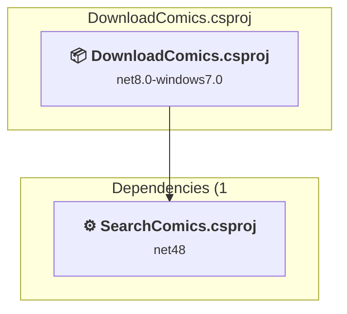
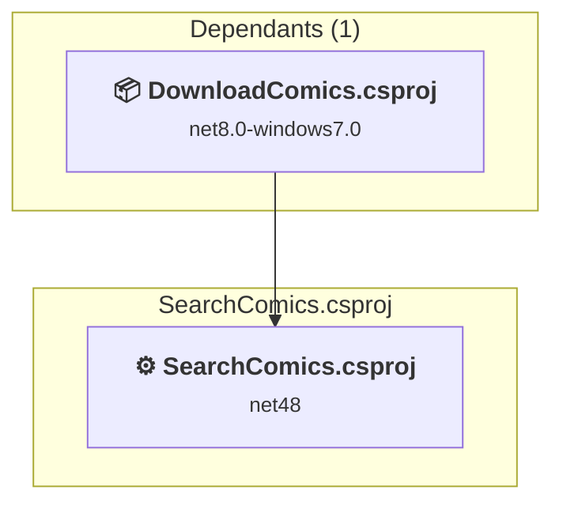

# Projects and dependencies analysis

This document provides a comprehensive overview of the projects and their dependencies in the context of upgrading to .NETCoreApp,Version=v10.0.

## Table of Contents

- [Executive Summary](#executive-Summary)
  - [Highlevel Metrics](#highlevel-metrics)
  - [Projects Compatibility](#projects-compatibility)
  - [Package Compatibility](#package-compatibility)
  - [API Compatibility](#api-compatibility)
- [Aggregate NuGet packages details](#aggregate-nuget-packages-details)
- [Top API Migration Challenges](#top-api-migration-challenges)
  - [Technologies and Features](#technologies-and-features)
  - [Most Frequent API Issues](#most-frequent-api-issues)
- [Projects Relationship Graph](#projects-relationship-graph)
- [Project Details](#project-details)

  - [DownloadComics\DownloadComics.csproj](#downloadcomicsdownloadcomicscsproj)
  - [SearchComics\SearchComics.csproj](#searchcomicssearchcomicscsproj)

## Executive Summary

### Highlevel Metrics

| Metric | Count | Status |
| :--- | :---: | :--- |
| Total Projects | 3 | All require upgrade |
| Total NuGet Packages | 5 | All compatible |
| Total Code Files | 23 |  |
| Total Code Files with Incidents | 23 |  |
| Total Lines of Code | 2365 |  |
| Total Number of Issues | 904 |  |
| Estimated LOC to modify | 901+ | at least 38,1% of codebase |

### Projects Compatibility

| Project | Target Framework | Difficulty | Package Issues | API Issues | Est. LOC Impact | Description |
| :--- | :---: | :---: | :---: | :---: | :---: | :--- |
| [DownloadComics\DownloadComics.csproj](#downloadcomicsdownloadcomicscsproj) | net8.0-windows7.0 | 🟡 Medium | 0 | 901 | 901+ | Wpf, Sdk Style = True |
| [SearchComics\SearchComics.csproj](#searchcomicssearchcomicscsproj) | net48 | 🟢 Low | 0 | 0 |  | ClassicDotNetApp, Sdk Style = False |

### Package Compatibility

| Status | Count | Percentage |
| :--- | :---: | :---: |
| ✅ Compatible | 5 | 100,0% |
| ⚠️ Incompatible | 0 | 0,0% |
| 🔄 Upgrade Recommended | 0 | 0,0% |
| ***Total NuGet Packages*** | ***5*** | ***100%*** |

### API Compatibility

| Category | Count | Impact |
| :--- | :---: | :--- |
| 🔴 Binary Incompatible | 872 | High - Require code changes |
| 🟡 Source Incompatible | 6 | Medium - Needs re-compilation and potential conflicting API error fixing |
| 🔵 Behavioral change | 23 | Low - Behavioral changes that may require testing at runtime |
| ✅ Compatible | 2797 |  |
| ***Total APIs Analyzed*** | ***3698*** |  |

## Aggregate NuGet packages details

| Package | Current Version | Suggested Version | Projects | Description |
| :--- | :---: | :---: | :--- | :--- |
| FuzzierSharp | 3.0.1 |  | [DownloadComics.csproj](#downloadcomicsdownloadcomicscsproj) | ✅Compatible |
| FuzzySharp | 2.0.2 |  | [SearchComics.csproj](#searchcomicssearchcomicscsproj) | ✅Compatible |
| HtmlAgilityPack | 1.12.4 |  | [DownloadComics.csproj](#downloadcomicsdownloadcomicscsproj) | ✅Compatible |
| Microsoft.Web.WebView2 | 1.0.3650.58 |  | [DownloadComics.csproj](#downloadcomicsdownloadcomicscsproj) | ✅Compatible |
| Newtonsoft.Json | 13.0.4 |  | [DownloadComics.csproj](#downloadcomicsdownloadcomicscsproj) | ✅Compatible |

## Top API Migration Challenges

### Technologies and Features

| Technology | Issues | Percentage | Migration Path |
| :--- | :---: | :---: | :--- |
| WPF (Windows Presentation Foundation) | 569 | 63,2% | WPF APIs for building Windows desktop applications with XAML-based UI that are available in .NET on Windows. WPF provides rich desktop UI capabilities with data binding and styling. Enable Windows Desktop support: Option 1 (Recommended): Target net9.0-windows; Option 2: Add <UseWindowsDesktop>true</UseWindowsDesktop>. |
| Legacy Configuration System | 6 | 0,7% | Legacy XML-based configuration system (app.config/web.config) that has been replaced by a more flexible configuration model in .NET Core. The old system was rigid and XML-based. Migrate to Microsoft.Extensions.Configuration with JSON/environment variables; use System.Configuration.ConfigurationManager NuGet package as interim bridge if needed. |

### Most Frequent API Issues

| API | Count | Percentage | Category |
| :--- | :---: | :---: | :--- |
| T:System.Windows.Controls.TextBox | 109 | 12,1% | Binary Incompatible |
| T:System.Windows.RoutedEventHandler | 64 | 7,1% | Binary Incompatible |
| T:System.Windows.Controls.Button | 56 | 6,2% | Binary Incompatible |
| P:System.Windows.Controls.TextBox.Text | 43 | 4,8% | Binary Incompatible |
| T:System.Windows.RoutedEventArgs | 32 | 3,6% | Binary Incompatible |
| T:System.Windows.Controls.ComboBox | 29 | 3,2% | Binary Incompatible |
| T:System.Windows.Controls.ListView | 27 | 3,0% | Binary Incompatible |
| T:System.Windows.Controls.CheckBox | 23 | 2,6% | Binary Incompatible |
| T:System.Windows.Controls.ItemCollection | 18 | 2,0% | Binary Incompatible |
| P:System.Windows.Controls.ItemsControl.Items | 18 | 2,0% | Binary Incompatible |
| E:System.Windows.Controls.Primitives.ButtonBase.Click | 17 | 1,9% | Binary Incompatible |
| T:System.Windows.Window | 15 | 1,7% | Binary Incompatible |
| T:System.Windows.MessageBoxImage | 14 | 1,6% | Binary Incompatible |
| T:System.Windows.MessageBoxButton | 14 | 1,6% | Binary Incompatible |
| M:System.Windows.Window.#ctor | 14 | 1,6% | Binary Incompatible |
| T:System.Uri | 13 | 1,4% | Behavioral Change |
| M:System.Windows.Controls.TextBox.Clear | 13 | 1,4% | Binary Incompatible |
| P:System.Windows.UIElement.IsEnabled | 12 | 1,3% | Binary Incompatible |
| T:System.Windows.Threading.Dispatcher | 11 | 1,2% | Binary Incompatible |
| T:System.Windows.Controls.Label | 11 | 1,2% | Binary Incompatible |
| P:System.Windows.Controls.Primitives.ToggleButton.IsChecked | 11 | 1,2% | Binary Incompatible |
| T:System.Windows.MessageBox | 10 | 1,1% | Binary Incompatible |
| T:System.Windows.MessageBoxResult | 10 | 1,1% | Binary Incompatible |
| M:System.Windows.Controls.ItemCollection.Add(System.Object) | 10 | 1,1% | Binary Incompatible |
| T:System.Windows.Controls.Slider | 10 | 1,1% | Binary Incompatible |
| T:System.Windows.Application | 10 | 1,1% | Binary Incompatible |
| P:System.Windows.Controls.ContentControl.Content | 10 | 1,1% | Binary Incompatible |
| T:System.Windows.Controls.TreeView | 10 | 1,1% | Binary Incompatible |
| P:System.Windows.Threading.DispatcherObject.Dispatcher | 9 | 1,0% | Binary Incompatible |
| M:System.Windows.Threading.Dispatcher.Invoke(System.Action) | 8 | 0,9% | Binary Incompatible |
| T:System.Windows.Controls.SelectionChangedEventHandler | 8 | 0,9% | Binary Incompatible |
| M:System.Uri.#ctor(System.String,System.UriKind) | 8 | 0,9% | Behavioral Change |
| P:System.Windows.Controls.Primitives.Selector.SelectedItem | 8 | 0,9% | Binary Incompatible |
| T:System.Windows.Controls.TreeViewItem | 8 | 0,9% | Binary Incompatible |
| E:System.Windows.Controls.MenuItem.Click | 8 | 0,9% | Binary Incompatible |
| P:System.Windows.Window.Owner | 7 | 0,8% | Binary Incompatible |
| M:System.Windows.Application.LoadComponent(System.Object,System.Uri) | 7 | 0,8% | Binary Incompatible |
| P:System.Windows.Controls.Primitives.Selector.SelectedIndex | 7 | 0,8% | Binary Incompatible |
| F:System.Windows.MessageBoxButton.OK | 7 | 0,8% | Binary Incompatible |
| M:System.Windows.MessageBox.Show(System.String,System.String,System.Windows.MessageBoxButton,System.Windows.MessageBoxImage) | 7 | 0,8% | Binary Incompatible |
| T:System.Windows.Markup.IComponentConnector | 7 | 0,8% | Binary Incompatible |
| P:System.Windows.FrameworkElement.Tag | 7 | 0,8% | Binary Incompatible |
| T:System.Windows.Controls.ListBox | 6 | 0,7% | Binary Incompatible |
| P:System.Windows.Controls.ItemsControl.ItemsSource | 6 | 0,7% | Binary Incompatible |
| M:System.Windows.Window.ShowDialog | 5 | 0,6% | Binary Incompatible |
| E:System.Windows.FrameworkElement.Loaded | 5 | 0,6% | Binary Incompatible |
| T:System.Windows.Controls.ProgressBar | 5 | 0,6% | Binary Incompatible |
| E:System.Windows.Controls.Primitives.Selector.SelectionChanged | 4 | 0,4% | Binary Incompatible |
| T:System.Windows.Controls.SelectionChangedEventArgs | 4 | 0,4% | Binary Incompatible |
| F:System.Windows.MessageBoxImage.Information | 4 | 0,4% | Binary Incompatible |

## Projects Relationship Graph

Legend:
📦 SDK-style project
⚙️ Classic project

## Project Details

### DownloadComics\DownloadComics.csproj

#### Project Info

- **Current Target Framework:** net8.0-windows7.0
- **Proposed Target Framework:** net10.0-windows
- **SDK-style**: True
- **Project Kind:** Wpf
- **Dependencies**: 1
- **Dependants**: 0
- **Number of Files**: 25
- **Number of Files with Incidents**: 22
- **Lines of Code**: 2153
- **Estimated LOC to modify**: 901+ (at least 41,8% of the project)

#### Dependency Graph

Legend:
📦 SDK-style project
⚙️ Classic project

### API Compatibility

| Category | Count | Impact |
| :--- | :---: | :--- |
| 🔴 Binary Incompatible | 872 | High - Require code changes |
| 🟡 Source Incompatible | 6 | Medium - Needs re-compilation and potential conflicting API error fixing |
| 🔵 Behavioral change | 23 | Low - Behavioral changes that may require testing at runtime |
| ✅ Compatible | 2586 |  |
| ***Total APIs Analyzed*** | ***3487*** |  |

#### Project Technologies and Features

| Technology | Issues | Percentage | Migration Path |
| :--- | :---: | :---: | :--- |
| Legacy Configuration System | 6 | 0,7% | Legacy XML-based configuration system (app.config/web.config) that has been replaced by a more flexible configuration model in .NET Core. The old system was rigid and XML-based. Migrate to Microsoft.Extensions.Configuration with JSON/environment variables; use System.Configuration.ConfigurationManager NuGet package as interim bridge if needed. |
| WPF (Windows Presentation Foundation) | 569 | 63,2% | WPF APIs for building Windows desktop applications with XAML-based UI that are available in .NET on Windows. WPF provides rich desktop UI capabilities with data binding and styling. Enable Windows Desktop support: Option 1 (Recommended): Target net9.0-windows; Option 2: Add <UseWindowsDesktop>true</UseWindowsDesktop>. |

### SearchComics\SearchComics.csproj

#### Project Info

- **Current Target Framework:** net48
- **Proposed Target Framework:** net10.0
- **SDK-style**: False
- **Project Kind:** ClassicDotNetApp
- **Dependencies**: 0
- **Dependants**: 1
- **Number of Files**: 2
- **Number of Files with Incidents**: 1
- **Lines of Code**: 212
- **Estimated LOC to modify**: 0+ (at least 0,0% of the project)

#### Dependency Graph

Legend:
📦 SDK-style project
⚙️ Classic project

### API Compatibility

| Category | Count | Impact |
| :--- | :---: | :--- |
| 🔴 Binary Incompatible | 0 | High - Require code changes |
| 🟡 Source Incompatible | 0 | Medium - Needs re-compilation and potential conflicting API error fixing |
| 🔵 Behavioral change | 0 | Low - Behavioral changes that may require testing at runtime |
| ✅ Compatible | 211 |  |
| ***Total APIs Analyzed*** | ***211*** |  |

